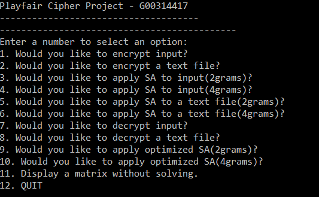
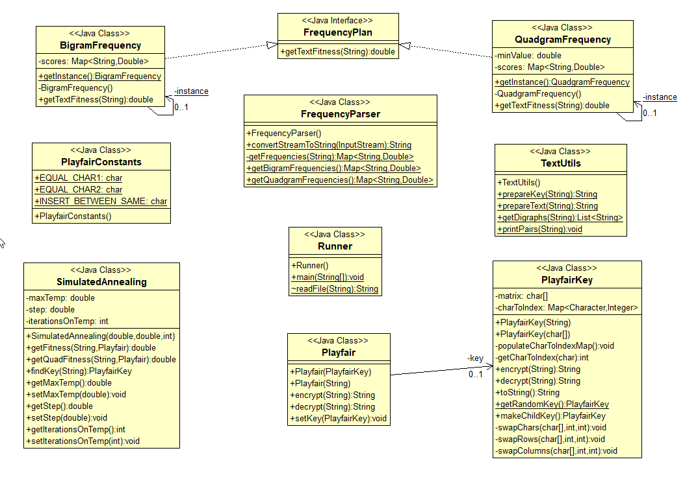

# AI-Project-Playfair-Cipher
 Artificial Intelligence module project for Semester 2 of 4th year. MyFile folder is where you drop txt files you want to use and is also where the results text file is printed, 2grams and 4grams are in this repository for testing the program too if needed.
 
 - Name: Conor Tighe
 - ID: G00314417

## Project brief:
The field of cryptanalysis is concerned with the study of ciphers, having as its objective the
identification of weaknesses within a cryptographic system that may be exploited to convert
encrypted data (cipher-text) into unencrypted data (plain-text). Whether using symmetric or
asymmetric techniques, cryptanalysis assumes no knowledge of the correct cryptographic key
or even the cryptographic algorithm being used.

Assuming that the cryptographic algorithm is known, a common approach for breaking a cipher
is to generate a large number of keys, decrypt a cipher-text with each key and then examine the
resultant plain-text. If the text looks similar to English, then the chances are that the key is a
good one. The similarity of a given piece of text to English can be computed by breaking the
text into fixed-length substrings, called n-grams, and then comparing each substring to an
existing map of n-grams and their frequency. This process does not guarantee that the outputted
answer will be the correct plain-text, but can give a good approximation that may well be the
right answer.

You are required to use the simulated annealing algorithm to break a Playfair Cipher. Your
application should have the following minimal set of features:

- A menu-driven command line UI that enables a cipher-text source to be specified (a
file or URL) and an output destination file for decrypted plain-text.

- Decrypt cipher-text with a simulated annealing algorithm that uses a log-probability
and n-gram statistics as a heuristic evaluation function.

# Introduction

The project that I've been requested to make is based on the playfair cipher, this is a manual 
symmetric encryption cipher invented in 1854 by Charles Wheatstone, however it’s name and popularity 
came from the endorsement of Lord Playfair. The playfair cipher starts with creating a key table. 
The key table is a 5×5 grid of letters that will act as the key for encrypting your plaintext. 
Each of the 25 letters must be unique and one letter of the alphabet (usually Q or J) is removed from the 
table (as there are 25 spots and 26 letters in the alphabet). In a playfair cipher the message is split into digraphs, 
typically pairs of two letters or four letters, this is what the "2grams.txt" and "4grams.txt" files are provided for
in the repository. When selecting options 2-5 fro the menu the program will use the gram.txt files with the Simulated Annealing algorithm
to break the code provided by the user.

## What is Simulated Annealing?
Simulated Annealing (SA) is an effective way of dealing with the problems presented in the hill climbing algorithm by adding a random tempature variable to reposisition
the current node of the search and help find a possible better solution for the user. Simulated annealing is typically used in discrete, but very large, configuration spaces, 
such as the set of possible orders of cities in the Traveling Salesman problem and in VLSI routing. It has a broad range of application that is still being explored.

```
Let s = s0
    For k = 0 through kmax (exclusive):
    T ← temperature(k ∕ kmax)
    Pick a random neighbour, snew ← neighbour(s)
    If P(E(s), E(snew), T) ≥ random(0, 1):
        s ← snew
Output: the final state s
```

## What is the fisher-yates shuffle?
This is the algorithm we use to move the elements in the key around when trying new keys around, The Fisher–Yates shuffle is an algorithm for generating a random sequence of elements. The modern version of the Fisher–Yates shuffle, designed for computer use, was introduced by Richard Durstenfeld in 1964. Below you can see sudo code of how to achevie this randomization.

```
for i from 0 to n−2 do
     j ← random integer such that i ≤ j < n
     exchange a[i] and a[j]
```

### Instructions to run project:

- Step 1. Navigate to .jar location in command line

- Step 2. java –cp ./playfair.jar ie.gmit.sw.ai.CipherBreaker

- Step 3. Enter a number to select an option



From here you can choose to encrypt, decrypt or apply simulated annealing to playfair encryted code. The user can set the maximum tempature used, the steps in tempature each move will take and the total iterations applied to the code, the user should play around with these values as they will vary the results. Once a result is reached they will be printed to a text file called results.txt which will be stored in the MyFiles folder of the
application. I tried to make the command line UI offer as much choice as possible as that was one of the main requirments in the brief.

## Project UML:


### References:
- [Simulated Annealing](http://www.cs.cmu.edu/afs/cs.cmu.edu/project/learn-43/lib/photoz/.g/web/glossary/anneal.html)
- [Playfair cipher](https://learncryptography.com/classical-encryption/playfair-cipher)
- [SA Sudo](https://en.wikipedia.org/wiki/Simulated_annealing#Pseudocode)
- [Fisher-yeats](https://en.wikipedia.org/wiki/Fisher%E2%80%93Yates_shuffle)